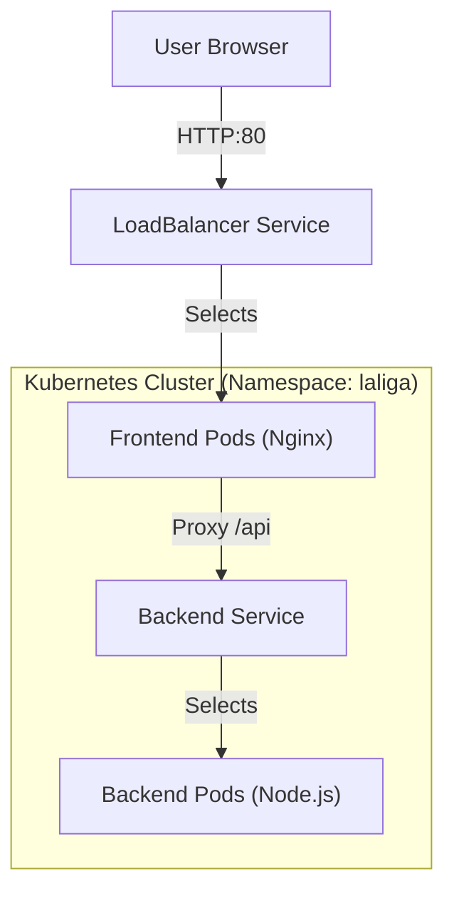

# La Liga Hub ⚽

A modern, visually stunning website showcasing La Liga's top teams and top scorers, containerized with Docker and deployed on Kubernetes.


## 🌟 Features

- **📊 League Standings** - Live La Liga table with team positions, points, and goal difference
- **⚽ Top Scorers** - Golden Boot race with goals and assists
- **📈 Statistics** - Season overview with key metrics
- **🎨 Modern Design** - Dark theme, glassmorphism cards, and smooth animations
- **⚡ Reactive UI** - CSS Grid layouts and custom-styled dropdowns
- **📱 Responsive** - Fully optimized for mobile, tablet, and desktop
- **🐳 Cloud Ready** - Docker containerized and Kubernetes deployed
- **🚀 Vercel** - Live deployment with Serverless Functions

## 🏗️ Architecture



## 📁 Project Structure

```
kubernetes/
├── frontend/
│   ├── index.html          # Main HTML page
│   ├── main.css            # Dark theme CSS (v5.0 cache-busted)
│   ├── fixtures-v2.js      # JavaScript app (v2 cache-busted)
│   ├── nginx.conf          # Nginx proxy configuration
│   └── Dockerfile          # Nginx Alpine image
├── backend/
│   ├── server.js           # Express API server
│   ├── data/               # Mock JSON data
│   └── Dockerfile          # Node.js Alpine image
├── k8s/
│   ├── namespace.yaml      # 'laliga' namespace
│   ├── frontend-*.yaml     # Deployment & Service (LoadBalancer)
│   ├── backend-*.yaml      # Deployment & Service (ClusterIP)
│   └── ingress.yaml        # Ingress rules
└── docker-compose.yml      # Local development config
```

## 🚀 Quick Start

### Option 1: Docker Compose (Fastest)

Ideal for local development without Kubernetes.

```bash
# Build and start
docker-compose up --build

# Access
# Frontend: http://localhost:8080
```

### Option 2: Live Deployment (Vercel)

The easiest way to view the live site and API without local setup.

👉 **[https://laliga-hub.vercel.app](https://laliga-hub.vercel.app)**

### Option 3: Kubernetes (Production-Like)

Deploy to a local cluster (Docker Desktop, Minikube).

#### 1. Build Images
```bash
docker build -t laliga-frontend:latest ./frontend
docker build -t laliga-backend:latest ./backend
```

#### 2. Deploy
```bash
# Create namespace and apply resources
kubectl apply -f k8s/namespace.yaml
kubectl apply -f k8s/
```

#### 3. Verify
```bash
# Check pods in the 'laliga' namespace
kubectl get pods -n laliga
```

#### 4. Access (Docker Desktop)
The frontend service is configured as a `LoadBalancer`, so it exposes port 80 on localhost.
👉 **Open http://localhost:80**

*(If port 80 is blocked, use port forwarding)*:
```bash
kubectl port-forward -n laliga svc/frontend-service 8080:80
# Open http://localhost:8080
```

## 🔧 Troubleshooting

### "localhost refused to connect"
- **Check Namespace**: Verify pods are running in the correct namespace:
  ```bash
  kubectl get pods -n laliga
  ```
  *(Running `kubectl get pods` checks the 'default' namespace, which is wrong)*.

- **Check Service**: Ensure external IP/Port is assigned:
  ```bash
  kubectl get svc -n laliga
  ```

### Browser Caching
- If old styles persist, do a hard refresh (Ctrl+F5).
- We use `?v=5.0` query strings and filenames like `main.css` to bust caches.

## 📊 Tech Stack

| Component | Technology |
|-----------|------------|
| Frontend | HTML5, CSS3 (Grid/Flex), Vanilla JS |
| Backend | Node.js 18, Express |
| Web Server | Nginx Alpine |
| Container | Docker |
| Orchestration | Kubernetes |

## 🎨 Design System

- **Colors**: `#0a0a0f` (Background), `#12121a` (Cards), `#ff2d55` (Accents)
- **Typography**: Inter / System UI
- **Effects**: Glassmorphism (`backdrop-filter: blur`), Hover Lifts

---

Made with ❤️ for La Liga fans
